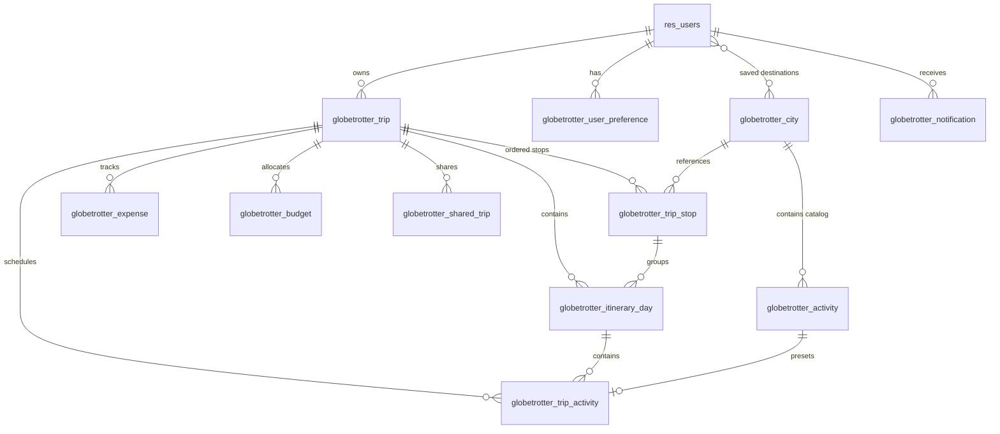

# GlobeTrotter — Odoo Backend & PostgreSQL Architecture

## 1. Executive Summary

GlobeTrotter's backend business and persistence layer is built natively in **Odoo (Python + PostgreSQL)**. It models multi-city travel planning, master catalogs, financial rollups, itinerary timelines, role-based access control, and link sharing while maintaining strict architectural boundaries with the Storybook Atlas frontend.

---

## 2. Odoo Module Structure

```text
addons/globetrotter/
├── __init__.py
├── __manifest__.py                  # Module descriptor, metadata, dependencies
├── models/                          # Odoo ORM Models
│   ├── __init__.py
│   ├── res_users.py                 # Extends res.users with preferences & trips
│   ├── user_preference.py           # globetrotter.user_preference
│   ├── city.py                      # globetrotter.city (Destination catalog)
│   ├── activity.py                  # globetrotter.activity (Master activities)
│   ├── trip.py                      # globetrotter.trip (Primary travel journey)
│   ├── trip_stop.py                 # globetrotter.trip_stop (Ordered route stops)
│   ├── itinerary_day.py             # globetrotter.itinerary_day (Daily planning units)
│   ├── trip_activity.py             # globetrotter.trip_activity (Scheduled activities)
│   ├── budget.py                    # globetrotter.budget (Financial breakdowns)
│   ├── expense.py                   # globetrotter.expense (Actual recorded spend)
│   ├── shared_trip.py               # globetrotter.shared_trip (Share tokens & cloning)
│   ├── notification.py              # globetrotter.notification (User alerts)
│   └── audit_log.py                 # globetrotter.audit_log (Admin audit trail)
├── controllers/                     # REST JSON API Layer
│   ├── __init__.py
│   ├── common.py                    # Standard response envelopes & auth decorators
│   ├── auth.py                      # Register, login, logout, me, reset-password
│   ├── trips.py                     # Trip CRUD & route stop operations
│   ├── destinations.py              # City catalog & saved destination toggles
│   ├── activities.py                # Master activities discovery
│   ├── itinerary.py                 # Activity scheduling, duplicate & move
│   ├── budget.py                    # Budget rollups & expense records
│   ├── sharing.py                   # Link sharing, public view & trip cloning
│   ├── profile.py                   # Traveler profile & travel preferences
│   ├── notifications.py             # Notifications feed & read acknowledgements
│   └── admin.py                     # Admin overview, user list, analytics & audit
├── security/
│   ├── security.xml                 # Groups (Traveler, Admin) & Record Rules
│   └── ir.model.access.csv          # Granular CRUD Model ACLs
├── data/
│   └── demo_data.xml                # Seeds Mumbai, Goa, Jaipur, etc., and Goa Adventure
├── views/
│   ├── trip_views.xml               # Backend tree/form views for Trips
│   ├── city_views.xml               # Backend views for Cities
│   ├── activity_views.xml           # Backend views for Master Activities
│   ├── budget_views.xml             # Backend views for Expenses
│   └── admin_views.xml              # Menus and admin desktop configuration
└── tests/
    ├── __init__.py
    └── test_globetrotter.py         # Automated ORM validation & constraint tests
```

---

## 3. Relational Hierarchy & Database Schema



### PostgreSQL Table Mapping

| Odoo Model | PostgreSQL Table | Primary Key | Foreign Keys / Relations |
| :--- | :--- | :--- | :--- |
| `globetrotter.city` | `globetrotter_city` | `id` | `activity_ids` (One2many) |
| `globetrotter.activity` | `globetrotter_activity` | `id` | `city_id` (`globetrotter_city.id`) |
| `globetrotter.trip` | `globetrotter_trip` | `id` | `user_id` (`res_users.id`) |
| `globetrotter.trip_stop` | `globetrotter_trip_stop` | `id` | `trip_id`, `city_id` |
| `globetrotter.itinerary_day`| `globetrotter_itinerary_day`| `id` | `trip_id`, `trip_stop_id` |
| `globetrotter.trip_activity`| `globetrotter_trip_activity`| `id` | `trip_id`, `itinerary_day_id`, `activity_id` |
| `globetrotter.budget` | `globetrotter_budget` | `id` | `trip_id` |
| `globetrotter.expense` | `globetrotter_expense` | `id` | `trip_id`, `user_id` |
| `globetrotter.shared_trip` | `globetrotter_shared_trip` | `id` | `trip_id`, `created_by` |
| `globetrotter.notification`| `globetrotter_notification`| `id` | `user_id` |
| `globetrotter.audit_log` | `globetrotter_audit_log` | `id` | `user_id` |

---

## 4. Security & Role-Based Access Control (RBAC)

### Groups
1. `globetrotter.group_traveler` (Implies `base.group_user`):
   - Permissions: Full CRUD over their own trips, trip stops, itinerary days, scheduled activities, expenses, notifications, and user preferences.
   - Read-only access to master catalog (`globetrotter.city`, `globetrotter.activity`).
2. `globetrotter.group_admin` (Implies `group_traveler`):
   - Full global management over all trips, users, catalog cities, activities, platform analytics, and audit logs.

### Server-Enforced Record Rules (Row-Level Security)
* **Trips**: `[('user_id', '=', user.id)]` for Traveler; `[(1, '=', 1)]` for Admin.
* **Trip Stops & Days & Activities**: `[('trip_id.user_id', '=', user.id)]` for Traveler.
* **Expenses**: `[('trip_id.user_id', '=', user.id)]` for Traveler.
* **Audit Logs**: Strictly isolated for Admin visibility only.

---

## 5. Constraints & Business Logic

1. **Date Validation Constraints**:
   - `trip.start_date <= trip.end_date` (Checked on `globetrotter.trip`).
   - `trip_stop.arrival_date <= trip_stop.departure_date` (Checked on `globetrotter.trip_stop`).
2. **Day and Trip Integrity**:
   - `itinerary_day.day_number >= 1`.
   - `itinerary_day.trip_stop_id.trip_id == itinerary_day.trip_id`.
   - `trip_activity.itinerary_day_id.trip_id == trip_activity.trip_id`.
3. **Financial Constraints & Rollups**:
   - `activity.estimated_cost >= 0`, `trip_activity.cost >= 0`, `expense.amount >= 0`.
   - Automatic computed fields calculate `estimated_cost` and `actual_spend` in real time.
4. **Trip Cloning Engine**:
   - `shared_trip.clone_to_user(target_user)` creates an isolated deep copy of the trip hierarchy (stops, days, scheduled activities, and base budgets).

---

## 6. How to Run the Odoo Backend

When deploying with an Odoo server:
```bash
odoo --addons-path="/path/to/odoo/addons,/Users/JBC/Desktop/odoo/addons" -d globetrotter_db -i globetrotter
```
